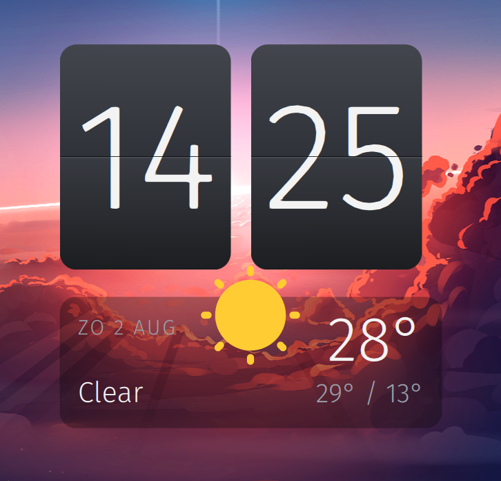

# Flip Clock

A split-flap flip clock widget for KDE Plasma 6, with a real two-phase flip
animation, light and dark themes, and a brass seconds sweep.



## Features

- Genuine split-flap animation — the top leaf falls forward on the seam,
  the bottom leaf drops into place behind it
- Dark, light, or follow-the-colour-scheme theming
- Seconds as a sweeping bar, a third flip card, or hidden
- 12/24 hour, optional date line
- Scales continuously — drag any resize handle and the whole composition
  follows
- Panel aware — sizes itself to the panel thickness and asks for only the
  width it actually needs, in both horizontal and vertical panels

## Install

From the KDE Store: right-click the desktop, **Add Widgets → Get New Widgets →
Download New Plasma Widgets**, then search for Flip Clock.

From a local file:

```bash
kpackagetool6 --type Plasma/Applet --install ./flipclock.plasmoid
```

To upgrade an existing install, swap `--install` for `--upgrade` and then
restart the shell:

```bash
systemctl --user restart plasma-plasmashell
```

## Configuration

Right-click the widget → **Configure Flip Clock**.

| Setting | Values | Default |
| --- | --- | --- |
| Theme | Dark / Light / Follow colour scheme | Dark |
| Seconds | Hidden / Sweeping bar / Flip card | Sweeping bar |
| 24-hour clock | on / off | on |
| Show date | on / off | on |
| Font family | any installed family | Fira Sans |
| Show weather | on / off | off |
| Location | city search | none |
| Fahrenheit | on / off | off |

The font falls back to the Qt default if the named family is not installed.
Check what you have with `fc-list : family`.

### In a panel

The date line is hidden automatically in a panel — at typical panel
thicknesses it would leave almost no room for the cards. Everything else
works the same. In a vertical panel the cards stack instead of sitting in
a row.

## Weather

Weather is off by default. Enable it under **Configure → Weather**, search for
your city, and pick it from the results list.

Data comes from [Open-Meteo](https://open-meteo.com/), which needs no API key
and no account. The widget makes one request every 15 minutes while it is
visible. Condition icons come from your icon theme.

## Requirements

- KDE Plasma 6
- Qt 6

## How this was built

This widget was developed with Claude, Anthropic's AI assistant, working from
my design direction and tested against a real Plasma 6 desktop at every step.
The AI wrote most of the QML; the design decisions, the testing, and the
judgement about what shipped were mine.

I mention it because I think it should be visible rather than assumed. Every
release is manually verified on a live system before it is published, and bug
reports go to a human.

## License

MIT — see [LICENSE](LICENSE).
